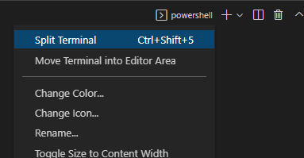

# Factory App

### Project Structure

- <b>client</b>:
  - <b>.next</b>
  - <b>config</b>
    - <b>default.ts</b>
    - <b>events.ts</b>
  - <b>containers</b>
    - <b>Messages.tsx</b>
    - <b>Rooms.tsx</b>
  - <b>context</b>
    - <b>socket.context.tsx</b>
  - <b>pages</b>
    - <b>\_app.tsx</b>
    - <b>index.tsx</b>
  - <b>public</b>
  - <b>styles</b>
    - <b>globals.css</b>
    - <b>Home.module.css</b>
    - <b>Messages.module.css</b>
    - <b>Room.module.css</b>
  - <b>.eslintrc.json</b>
  - <b>.gitignore</b>
  - <b>next-env.d.ts</b>
  - <b>next.config.js</b>
  - <b>package.json</b>
  - <b>tsconfig.json</b>
- <b>img</b>
- <b>server</b>
  - <b>config</b>
    - <b>default.ts</b>
  - <b>src</b>
    - <b>utils</b>
      - <b>logger.ts</b>
    - <b>app.ts</b>
    - <b>socket.ts</b>
  - <b>nodemon.json</b>
  - <b>package.json</b>
  - <b>tsconfig.json</b>
  - <b>yarn.lock</b>
- <b>.gitignore</b>
- <b>README</b>

### Import project from Visual Studio Code

- Clone project from Github: Execute:
  ```
  git clone https://github.com/oscarvargas4/itacademy-sprint5-MERNChatApp.git
  ```

### How to run the project:

1. Open a new Terminal and split it into `client`and `server` (rename each terminal):




2. In `server`console:

   ```
   cd server
   yarn add
   ```

   Then:

   ```
   yarn run dev
   ```

   In `client`console:

   ```
   cd client
   npm install
   ```

   Then:

   ```
   npm run dev
   ```
